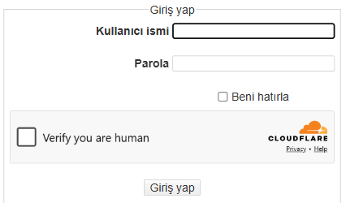

# Cloudflare Turnstile Plugin for DokuWiki

[](https://github.com/erkancinar/dokuwiki-plugin-turnstile/actions/workflows/dokuwiki.yml)
[](https://www.dokuwiki.org/plugin:turnstile)
[](LICENSE)

Protects the login, password reset and registration forms and, if you want, page editing and discussion comments with
[Cloudflare Turnstile](https://developers.cloudflare.com/turnstile/), a free, privacy friendly
CAPTCHA alternative. The token is verified on the server before DokuWiki looks at the password,
so bots trying passwords never reach your user backend.



Full documentation: **https://www.dokuwiki.org/plugin:turnstile**

## Installation

Search for "turnstile" in the [Extension Manager](https://www.dokuwiki.org/plugin:extension) of your wiki.
If you install the plugin manually, it must end up in `lib/plugins/turnstile/` — with any other
folder name it will not work.

Compatible with DokuWiki Kaos (2024-02-06), Librarian (2025-05-14) and Mort (2026-07-14).

## Quick start

1. In the Cloudflare dashboard open **Turnstile → Add widget**, enter the host name of your wiki and
   choose the *Managed* mode. A free Cloudflare account is enough; your site does not need to use
   Cloudflare's proxy or DNS.
2. Enter the site key and the secret key in the Configuration Manager (section *Turnstile Plugin*).
   The plugin is inactive while a key is empty, so installing it never locks anybody out.

## What is checked

- Submitted login, password reset and registration forms (selectable). A token solved on one form
  does not work on another.
- HTTP Basic authentication logins, except on the remote API endpoints (`lib/exe/jsonrpc.php`,
  `lib/exe/xmlrpc.php`) while the remote API is enabled. Set `basicauth` to `all` if your web server
  logs users in via HTTP authentication.
- Logins from the session cookie are never checked.
- Saving a page in the editor, if *Page editing* is selected (off by default). A failed check turns
  the save into a preview, so the text is kept and can be saved again with a new check. Previews and
  drafts are not checked. Logged-in users are not asked unless `forusers` is switched on.
- Comments of the [discussion plugin](https://www.dokuwiki.org/plugin:discussion), if *Discussion comments*
  is selected. The discussion plugin itself calls the check, so it needs a version with Turnstile support
  ([dokufreaks/plugin-discussion#386](https://github.com/dokufreaks/plugin-discussion/pull/386)). The
  `forusers` setting applies here too.

An invalid, expired or reused token is always rejected. What happens when Cloudflare cannot be
reached is configurable (`failmode`, default: reject).

## Limitations

- While the remote API is enabled, HTTP Basic logins to the API endpoints and the API's own login
  method are not covered. Use rate limiting (for example fail2ban) if the API is reachable from the
  internet.
- Login forms that a template renders without DokuWiki's form API show no widget; logins through
  them are rejected.
- Pages written through the remote API and reverting to an old revision are not checked: there is no
  form to show the widget in. Limit them with ACLs if anonymous users may edit.

## Protecting forms of other plugins

Other plugins can use the helper component, see the comment at the top of
[helper.php](helper.php).

## Locked out?

If wrong keys keep everybody from logging in, remove the lines
`$conf['plugin']['turnstile']['sitekey']` and `$conf['plugin']['turnstile']['secretkey']` from
`conf/local.php`, or disable the plugin by adding this line to `conf/plugins.local.php`:

```php
$plugins['turnstile'] = 0;
```

## Contributing

Bug reports and pull requests are welcome. Please report security problems privately, see
[SECURITY.md](SECURITY.md).

## License

Copyright (C) Erkan Çınar <erkancinar@gmail.com>

This program is free software; you can redistribute it and/or modify it under the terms of the
GNU General Public License as published by the Free Software Foundation; version 2 of the License.

This program is distributed in the hope that it will be useful, but WITHOUT ANY WARRANTY; without
even the implied warranty of MERCHANTABILITY or FITNESS FOR A PARTICULAR PURPOSE. See the
[LICENSE](LICENSE) file for details.
